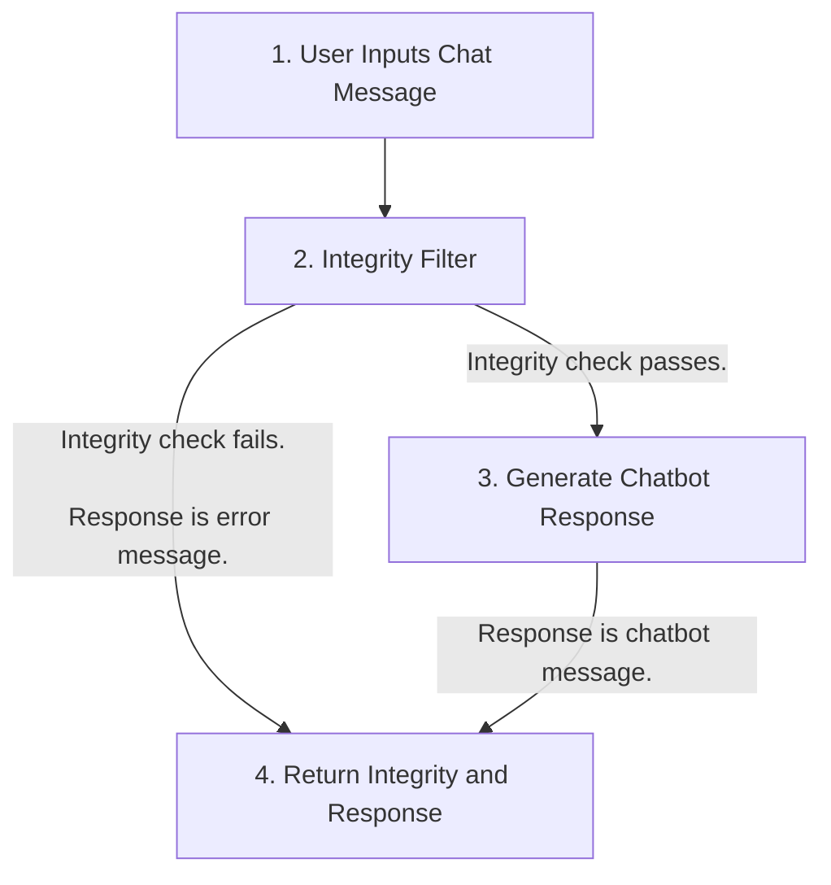

# Canary
 LLM prompt injection detection.

[](https://opensource.org/licenses/MIT)


## How it works

1. User submits a potentially malicious message.
2. The message is passed through a LLM prompted to format the message plus a unique key into a JSON. In the event the message is a malicious prompt, this output should be compromised. If the output is an invalid JSON, is missing a key, or a key-value doesn't match the expected values, then the integrity may be compromised.
3. If the integrity check passes, the user message is forwarded to the guarded LLM (e.g.: the application chatbot, etc.).
4. The API returns the result of the integrity test (boolean) and either the chatbot response (if integrity passes) or an error message (if integrity fails).



What this solution can do:
* Detect inputs that override an LLMs initial / system prompt.

What this solution cannot do:
* Neutralise malicious prompts.

## Install

1. Clone this repository locally.
2. Create `.envrc` and set `OPENAI_API_KEY` according to `.envrc.example.sh`.
3. Install with poetry.

```bash
make install    # Install dependencies
make test       # Run unit tests to check installation
```

## Usage

* Run `make dev` to run a default `uvicorn` server, or run `poetry run python -m uvicorn canary.src.main:app --reload --port=8000` to customise your deployment settings.
* Query the `/chat` endpoint, e.g.: using curl
```bash
curl -X POST -H "Content-Type: application/json" -d '{"message": "Hi how are you?"}' http://127.0.0.1:8000/chat
```

## FastAPI Docs

Visit the `/docs` endpoint of your FastAPI server.

## License

MIT
